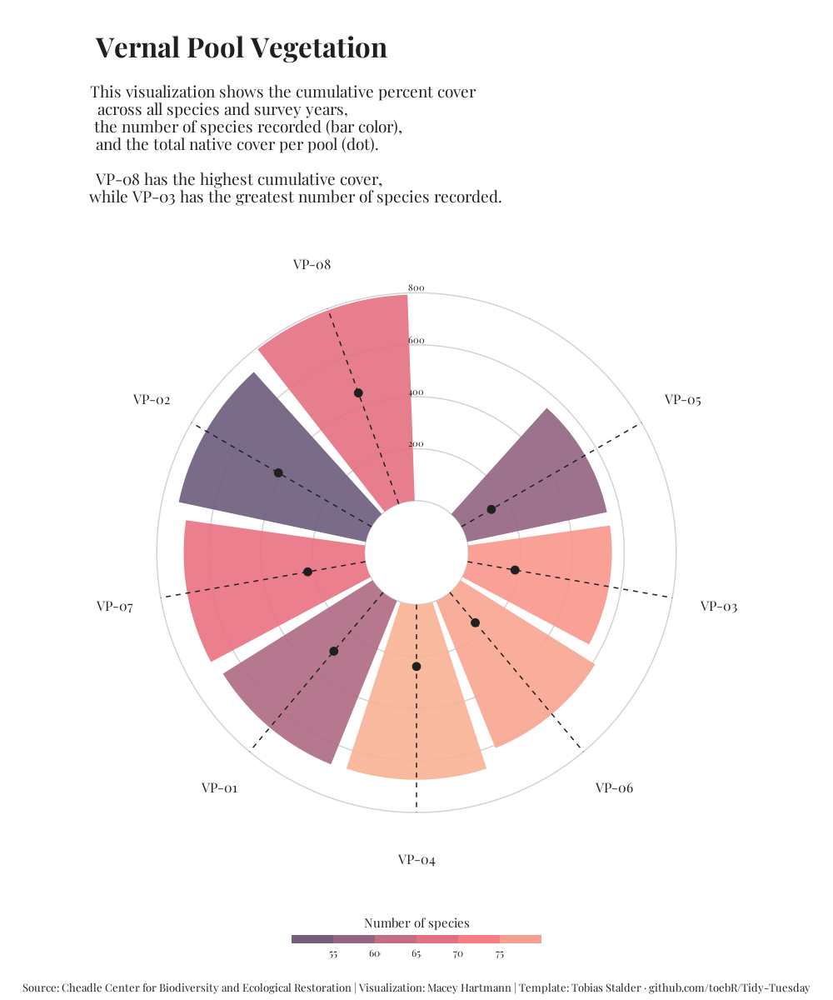

# ENVS 193DD Intermediate Elective 2

## General information

This repository contains data and code to visualize cumulative percent cover, 
number of plant species recorded, and total native cover across eight vernal 
pools at NCOS. It also contains (edited) code from Tobias 
Stalder's __["Hiking Locations in Washington"](https://github.com/toebR/Tidy-Tuesday/tree/master/hiking)__ 
visualization, which was used as inspiration for the vernal pool vegetation visualization.

To work with the code in this repository, you will need the following packages:

```r
library(tidyverse)
library(here)
library(prismatic)
library(scales)
library(showtext)
```

## Data and file information

```
├── README.md
├── code
│   ├── intermediate-elective-code.qmd  # Vernal pool vegetation viz
│   └── intermediate-elective-code.pdf  # Vernal pool vegetation pdf
├── data
│   ├── veg.csv                         # vegetation transect data
│   └── vp_veg_metadata.csv             # pool-level metadata
├── images
│   └── figure2.png                     # figure sketch
├── outputs
│   └── vp_circular_barchart.png        # output of vegetation viz
└── intermediate-elective.Rproj
```

## Rendered output

The rendered output can be found __[here](https://github.com/maceyhartmann/intermediate-elective/blob/main/code/intermediate-elective-code.pdf)__




